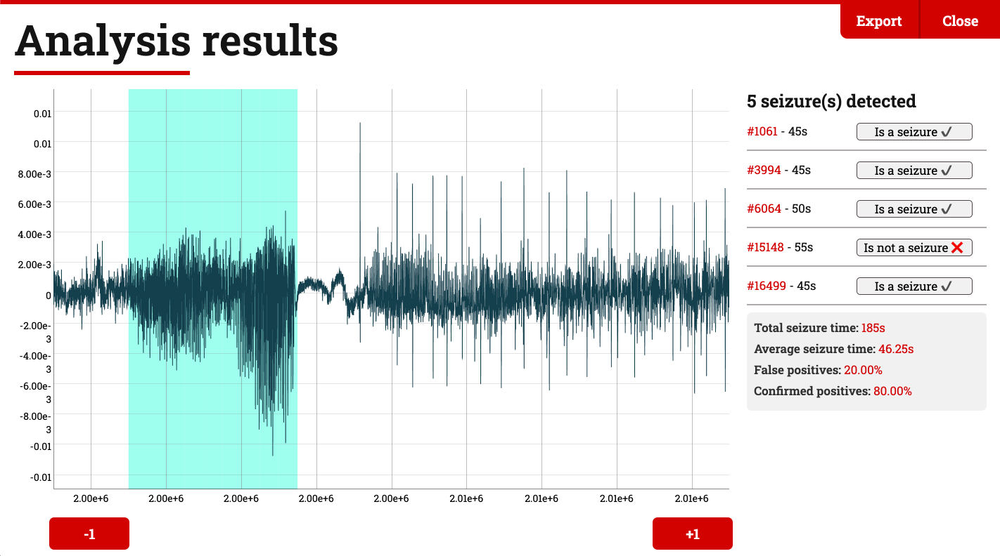

# Maguire Lab's Deep Learning Seizure Detection WebApp
🧠 **Try it online:** https://deep-seizure-detect.herokuapp.com

⚠️ **Current version:** v0.1 Alpha

---

## About
This web app allows to run a set of rodent single-channel EEG data against a deep learning model to detect seizures.

---

## How does it work
- Provide the app a CSV file containing rodent EEG data, each line being a sequence of 500 samples at 100hz.

- The app will read the file and send it by chunks to our server, where our machine learning algorithm runs. Nothing is stored on our end.

- Once the whole file has been processed, the app generates a dynamic visualization allowing to consult, edit and export results.

---

## Authors, license and intended use

Built with the [Maguire Lab at Tufts University](https://www.maguirelab.com/) by:

Matteo Cargnelutti | Pantelis Antonoudiou, Phd
------------------ | --------------------------
 | 
Software Development | Data Science
Boston, USA / France 🇫🇷 | Boston, USA / Cyprus 🇨🇾
[@macargnelutti](https://twitter.com/macargnelutti)| [@PAntonoudiou](https://twitter.com/PAntonoudiou)

This open-source software is distributed under [the Apache 2.0 License](/LICENSE).

This software was built and made available for research purposes only and is intended for use on rodent data.

---

## Resources and references
["How Deep Learning Solved My Seizure Detection Problems"](https://journals.sagepub.com/doi/10.1177/1535759720948430). 
Commentary by Pantelis Antonoudiou and Jamie L. Maguire. on Epilepsy Currents, Sept 2 2020.

---

## Acknowledgments
Many thanks to [Dr. Trina Basu](https://twitter.com/trina_basu) for allowing us to use some of her data to build the model and test the application.

---

A bug to report? A question? An idea to suggest? Please [contact us via the _issues_ section](https://github.com/matteocargnelutti/maguire-lab-seizure-detection-webapp/issues).